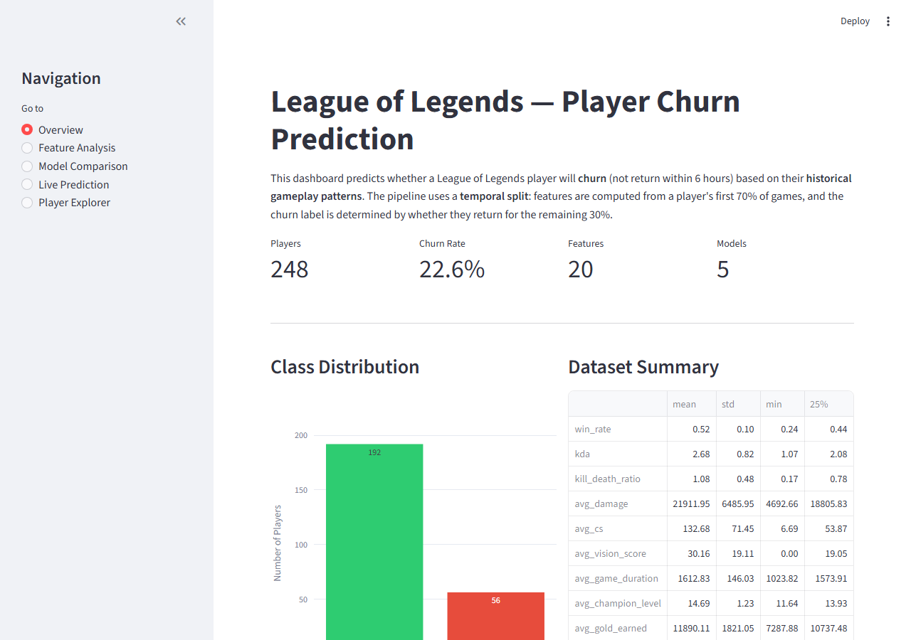
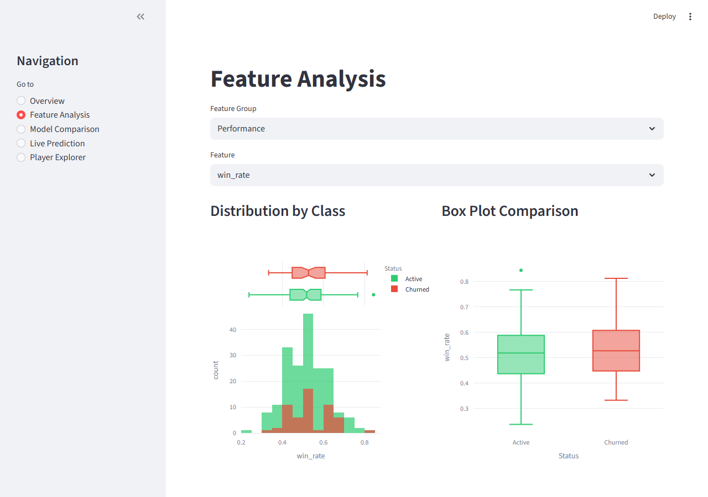
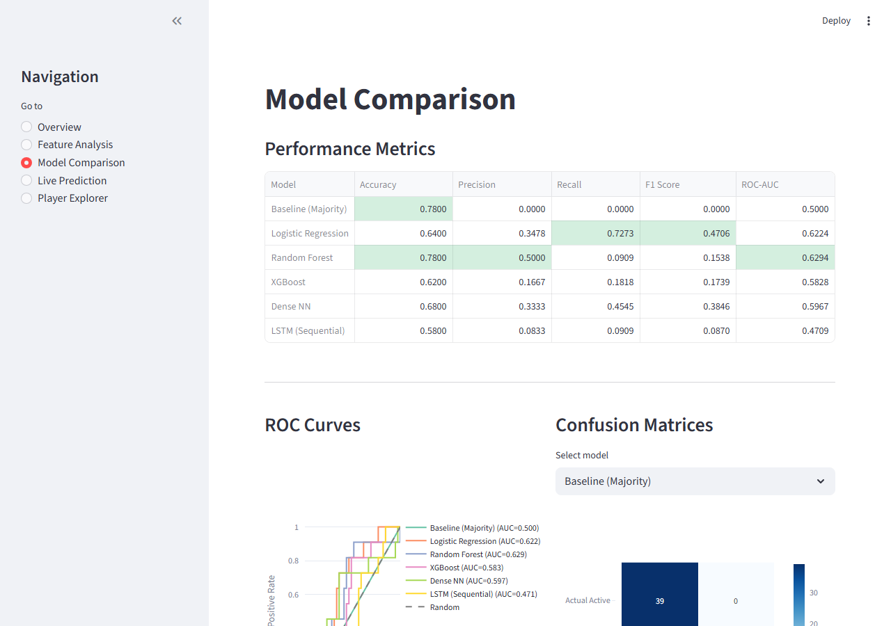
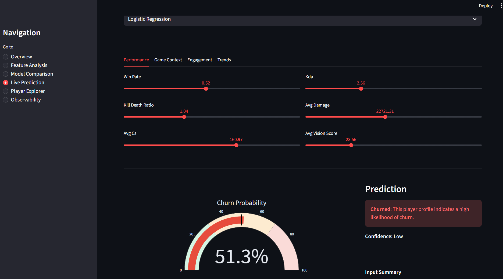
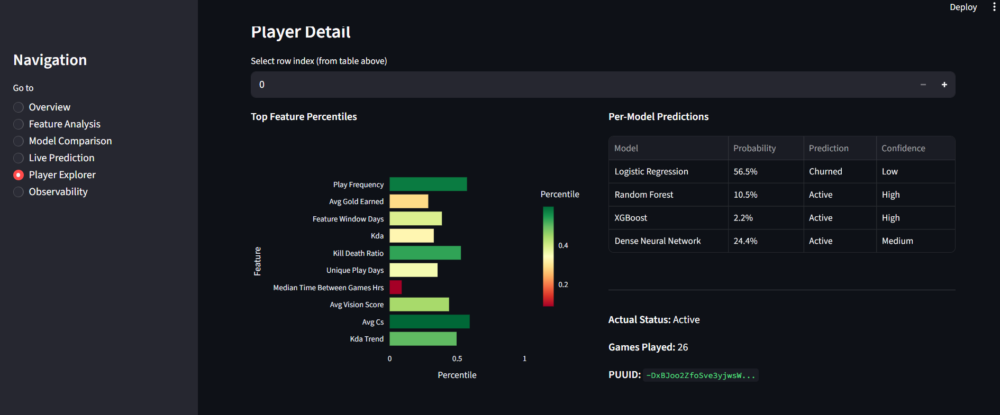

# League of Legends Player Churn Prediction

A machine learning pipeline that predicts whether a League of Legends player will **churn** (disengage from the game) based on their historical gameplay patterns. Includes data collection from the Riot API, temporal feature engineering, five classification models, and an interactive Streamlit dashboard.



---

## Table of Contents

- [Motivation](#motivation)
- [How It Works](#how-it-works)
- [Features](#features)
- [Models & Results](#models--results)
- [Dashboard](#dashboard)
- [Project Structure](#project-structure)
- [Getting Started](#getting-started)
- [Tech Stack](#tech-stack)

---

## Motivation

Player retention is one of the most important metrics in online gaming. Identifying players who are likely to stop playing allows game companies to intervene early through targeted rewards, matchmaking adjustments, or re-engagement campaigns. This project builds an end-to-end churn prediction system using real match data pulled directly from Riot's API.

---

## How It Works

### Temporal Split Methodology

Unlike naive approaches that use all of a player's data to predict their own label (data leakage), this project enforces a strict **temporal split**:

```
Player's Match History (sorted by time)
├── Feature Window (first 70% of games) → Compute 20 behavioral features
└── Label Window (remaining 30% of games) → Determine churn label
```

- **Churn definition**: A player is labeled as "churned" if the gap between the end of their feature window and their next game exceeds **6 hours**
- **Minimum 10 games** per player to ensure sufficient data
- A programmatic **leakage detection** module verifies that no label-window data leaked into features

### Data Collection

Match data is collected live from the **Riot Games API** using a BFS-based player discovery approach:
1. Start from a seed player on the NA Challenger ladder
2. Fetch their recent matches and discover new players from those games
3. For each qualified player (10+ matches), pull up to 50 matches
4. Rate-limited to stay within API constraints.

---

## Features

20 engineered features across four categories:

| Category | Features |
|----------|----------|
| **Performance** | `win_rate`, `kda`, `kill_death_ratio`, `avg_damage`, `avg_cs`, `avg_vision_score` |
| **Game Context** | `avg_game_duration`, `avg_champion_level`, `avg_gold_earned`, `gold_efficiency`, `unique_champions` |
| **Engagement** | `total_games_played`, `unique_play_days`, `avg_time_between_games_hrs`, `median_time_between_games_hrs`, `play_frequency`, `feature_window_days` |
| **Trends** | `kda_trend`, `winrate_trend`, `last_gap_days` |

All features are computed **exclusively** from the feature window (first 70% of games) to prevent data leakage.

---

## Models & Results

Six models were trained and evaluated (including a majority-class baseline):

| Model | Accuracy | Precision | Recall | F1 Score | ROC-AUC |
|-------|----------|-----------|--------|----------|---------|
| Baseline (Majority) | 0.7800 | 0.0000 | 0.0000 | 0.0000 | 0.5000 |
| Logistic Regression | 0.6400 | 0.3478 | **0.7273** | 0.4706 | 0.6224 |
| Random Forest | **0.7800** | **0.5000** | 0.0909 | 0.1538 | **0.6294** |
| XGBoost | 0.6200 | 0.1667 | 0.1818 | 0.1739 | 0.5828 |
| Dense Neural Network | 0.6800 | 0.3333 | 0.4545 | 0.3846 | 0.5967 |
| LSTM (Sequential) | 0.5800 | 0.0833 | 0.0909 | 0.0870 | 0.4709 |

**5-Fold Stratified Cross-Validation** (sklearn models):

| Model | F1 (mean ± std) | ROC-AUC (mean ± std) |
|-------|-----------------|----------------------|
| Logistic Regression | 0.408 ± 0.151 | 0.638 ± 0.131 |
| Random Forest | 0.000 ± 0.000 | 0.540 ± 0.058 |
| XGBoost | 0.153 ± 0.086 | 0.546 ± 0.034 |

> **Key takeaway**: With 248 players and a 22.6% churn rate, Random Forest achieves the highest accuracy but struggles with recall. Logistic Regression has the best recall for identifying churned players. These results reflect the genuine difficulty of churn prediction with a small, real-world dataset no inflated metrics from data leakage.

---

## Dashboard

An interactive **Streamlit** dashboard with 5 pages:

### 1. Overview
Project summary, class distribution, dataset statistics, and data quality validation checks.


### 2. Feature Analysis
Explore feature distributions by class, box plot comparisons, correlation heatmaps, feature importance rankings, and statistical t-tests.



### 3. Model Comparison
Performance metrics table, ROC curves, confusion matrices, confidence intervals, training history plots, cross-validation results, precision-recall curves, and learning curves.



### 4. Live Prediction
Adjust sliders to simulate a player's stats and see real-time churn predictions with a probability gauge.



### 5. Player Explorer
Browse individual players, filter by churn status or games played, view per-model predictions and feature percentiles.



---

## Project Structure

```
lol-player-retention/
├── app.py                          # Streamlit dashboard (5 pages)
├── train.py                        # Model training + validation pipeline
├── collect_data.py                 # Riot API data collection (BFS discovery)
├── feature_extraction_temporal.py  # Temporal split feature engineering
├── feature_engineering.py          # Data loading, cleaning, quality checks
├── feature_extraction.py           # Original feature extraction
├── model.py                        # Original model definitions
├── clean.py                        # Data cleaning utilities
├── Riot_API_Data_Retrieving.py     # Original Riot API interface
├── requirements.txt                # Python dependencies
├── data/
│   └── player_features_temporal.csv  # Processed player features (248 players)
├── models/
│   ├── logistic_regression.joblib
│   ├── random_forest.joblib
│   ├── xgboost_model.joblib
│   ├── neural_network.keras
│   ├── lstm_model.keras
│   ├── scaler.joblib               # StandardScaler for tabular features
│   ├── seq_scaler.joblib            # StandardScaler for LSTM sequences
│   ├── model_comparison.json        # All model metrics
│   ├── cv_results.json              # Cross-validation results
│   ├── feature_importance.json      # Random Forest feature importances
│   ├── data_quality.json            # Data quality check results
│   ├── leakage_check.json           # Temporal integrity verification
│   ├── learning_curves.json         # Learning curves for LR & RF
│   ├── training_features.json       # List of 20 feature names
│   └── plots/                       # Saved visualizations
└── screenshots/                     # Dashboard screenshots
```

---

## Getting Started

### Prerequisites

- Python 3.9+
- A [Riot Games API key](https://developer.riotgames.com/) (only needed for data collection)

### Installation

```bash
git clone https://github.com/JayanthJammula/lol-player-retention.git
cd lol-player-retention
pip install -r requirements.txt
```

### Run the Dashboard

The repo includes pre-trained models and processed features, so you can launch the dashboard immediately:

```bash
streamlit run app.py
```

### Retrain Models (optional)

To retrain all models from the existing feature data:

```bash
python train.py
```

### Collect Fresh Data (optional)

To collect new match data from the Riot API:

```bash
# Create a .env file with your API key
echo "RIOT_API_KEY=your_key_here" > .env

# Run data collection (takes ~30 min for 250 players)
python collect_data.py

# Extract features
python feature_extraction_temporal.py

# Train models
python train.py
```

---

## Tech Stack

- **Data Collection**: Riot Games API, `requests`
- **Data Processing**: `pandas`, `numpy`
- **Machine Learning**: `scikit-learn`, `xgboost`
- **Deep Learning**: `tensorflow` / `keras` (Dense NN + Bidirectional LSTM)
- **Dashboard**: `streamlit`, `plotly`
- **Visualization**: `matplotlib`, `seaborn`

---

> **Note**: The current results are based on 250 players. A 500-player dataset update is coming soon with retrained models and updated metrics.
