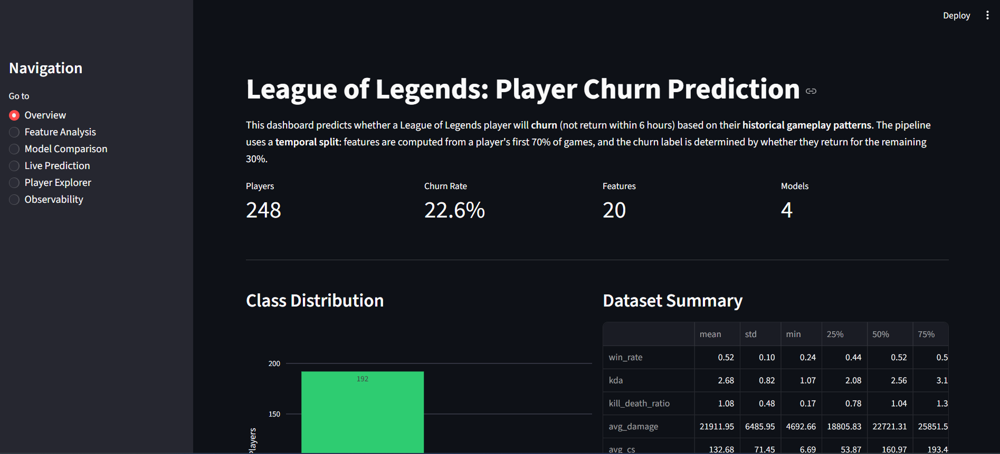
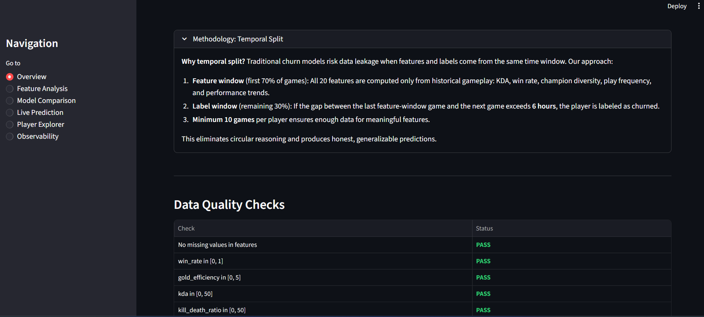
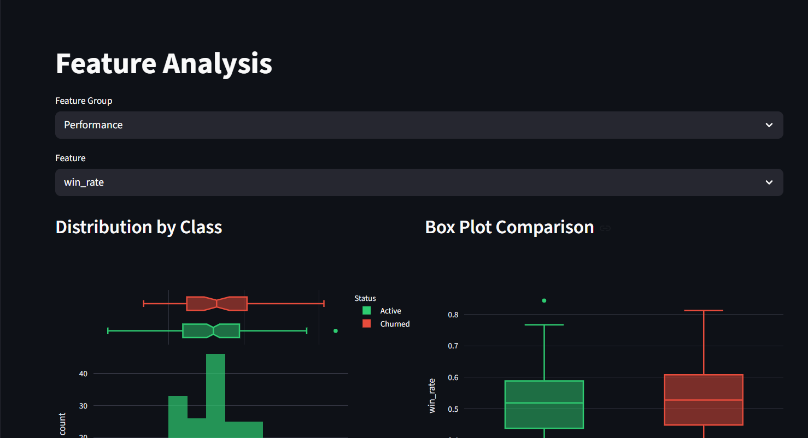
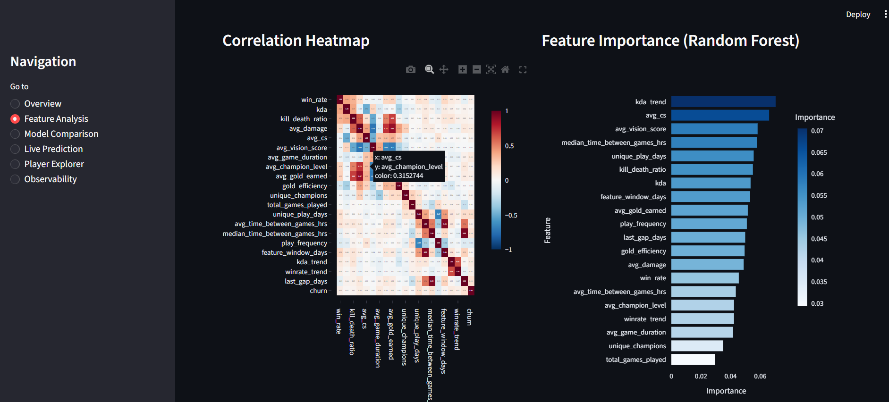
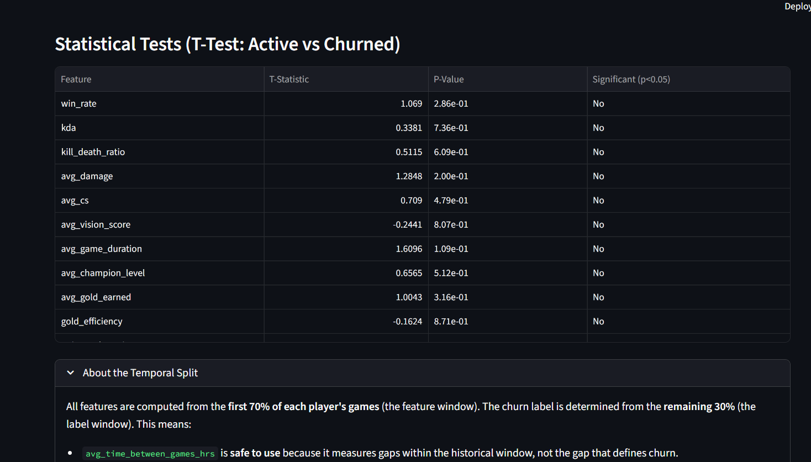
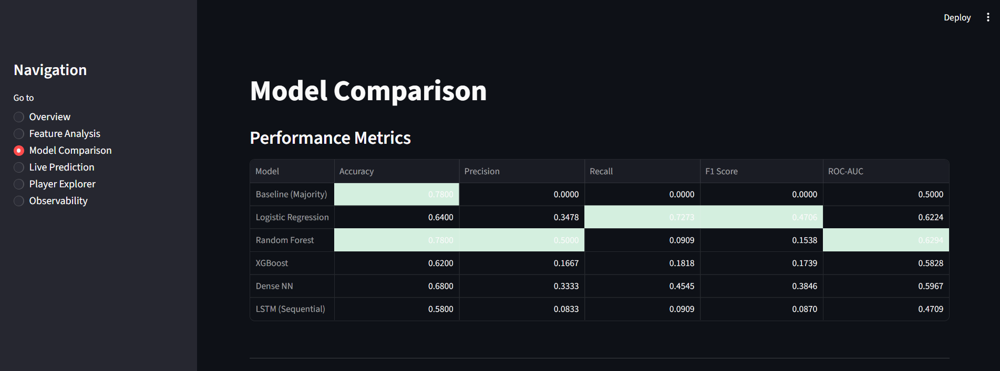
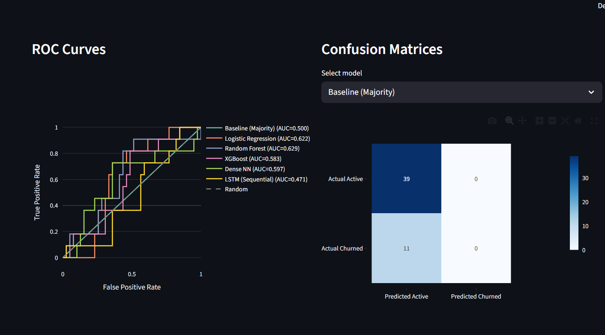
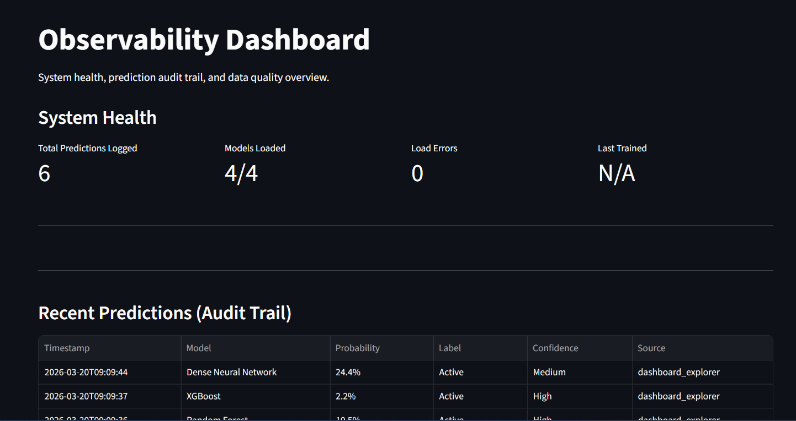

# League of Legends Player Churn Prediction

A machine learning pipeline that predicts whether a League of Legends player will **churn** (disengage from the game) based on their historical gameplay patterns. Includes data collection from the Riot API, temporal feature engineering, five classification models, structured prediction outputs with validation, a regression test suite, and an interactive Streamlit dashboard.

<table>
  <tr>
    <td></td>
    <td></td>
  </tr>
</table>

---

## Table of Contents

- [Motivation](#motivation)
- [How It Works](#how-it-works)
- [Features](#features)
- [Models and Results](#models-and-results)
- [Dashboard](#dashboard)
- [Project Structure](#project-structure)
- [Getting Started](#getting-started)
- [Running Tests](#running-tests)
- [Tech Stack](#tech-stack)

---

## Motivation

Player retention is one of the most important metrics in online gaming. Identifying players who are likely to stop playing allows game companies to intervene early through targeted rewards, matchmaking adjustments, or re-engagement campaigns. This project builds an end-to-end churn prediction system using real match data pulled directly from Riot's API.

---

## How It Works

### Temporal Split Methodology

Unlike naive approaches that use all of a player's data to predict their own label (data leakage), this project enforces a strict **temporal split**:

```
Player's Match History (sorted by time)
|-- Feature Window (first 70% of games) -> Compute 20 behavioral features
|-- Label Window (remaining 30% of games) -> Determine churn label
```

- **Churn definition**: A player is labeled as "churned" if the gap between the end of their feature window and their next game exceeds **6 hours**
- **Minimum 10 games** per player to ensure sufficient data
- A programmatic **leakage detection** module verifies that no label-window data leaked into features

### Data Collection

Match data is collected live from the **Riot Games API** using a BFS-based player discovery approach:
1. Start from a seed player on the NA Challenger ladder
2. Fetch their recent matches and discover new players from those games
3. For each qualified player (10+ matches), pull up to 50 matches
4. Rate-limited with adaptive retry logic to stay within API constraints

### Prediction Pipeline

Predictions flow through a structured pipeline with validation at every step:

```
Raw Input (slider values / player data)
  -> validate_feature_input()     [schema validation, range checks]
  -> make_prediction()            [scaling, inference, structuring]
  -> PredictionResult             [typed output with full metadata]
  -> log_prediction()             [audit trail]
  -> detect_feature_drift()       [distribution drift warnings]
```

Every prediction returns a typed `PredictionResult` with probability, label, confidence level, model version, and timestamp. Input validation catches bad data before it reaches any model, and feature drift detection flags inputs that fall far outside the training distribution.

### Data Quality and Training Safeguards

Training is gated behind 13 automated data quality checks (missing values, feature ranges, churn rate bounds, duplicate detection, infinite values). If any check fails, the pipeline halts with a clear error rather than training on corrupt data.

Each training run generates:
- **Model metadata** (`model_metadata.json`): version, training date, dataset hash, performance snapshot, hyperparameters
- **Training statistics** (`training_stats.json`): per-feature mean, std, min, max for drift detection at prediction time
- **Structured logs**: timestamped, leveled logs to `logs/`

### Prediction Audit Trail

Every prediction made through the dashboard is logged to `logs/prediction_audit.jsonl` with the model name, version, input features, output probability, and timestamp. This makes predictions fully traceable and debuggable after the fact.

---

## Features

20 engineered features across four categories, all computed **exclusively** from the feature window (first 70% of games):

| Category | Features |
|----------|----------|
| **Performance** | `win_rate`, `kda`, `kill_death_ratio`, `avg_damage`, `avg_cs`, `avg_vision_score` |
| **Game Context** | `avg_game_duration`, `avg_champion_level`, `avg_gold_earned`, `gold_efficiency`, `unique_champions` |
| **Engagement** | `total_games_played`, `unique_play_days`, `avg_time_between_games_hrs`, `median_time_between_games_hrs`, `play_frequency`, `feature_window_days` |
| **Trends** | `kda_trend`, `winrate_trend`, `last_gap_days` |

---

## Models and Results

Six models were trained and evaluated (including a majority-class baseline):

| Model | Accuracy | Precision | Recall | F1 Score | ROC-AUC |
|-------|----------|-----------|--------|----------|---------|
| Baseline (Majority) | 0.7800 | 0.0000 | 0.0000 | 0.0000 | 0.5000 |
| Logistic Regression | 0.6400 | 0.3478 | **0.7273** | 0.4706 | 0.6224 |
| Random Forest | **0.7800** | **0.5000** | 0.0909 | 0.1538 | **0.6294** |
| XGBoost | 0.6200 | 0.1667 | 0.1818 | 0.1739 | 0.5828 |
| Dense Neural Network | 0.6800 | 0.3333 | 0.4545 | 0.3846 | 0.5967 |
| LSTM (Sequential) | 0.5800 | 0.0833 | 0.0909 | 0.0870 | 0.4709 |

**5-Fold Stratified Cross-Validation** (sklearn models):

| Model | F1 (mean +/- std) | ROC-AUC (mean +/- std) |
|-------|-----------------|----------------------|
| Logistic Regression | 0.408 +/- 0.151 | 0.638 +/- 0.131 |
| Random Forest | 0.000 +/- 0.000 | 0.540 +/- 0.058 |
| XGBoost | 0.153 +/- 0.086 | 0.546 +/- 0.034 |

> **Key takeaway**: With 248 players and a 22.6% churn rate, these results reflect the genuine difficulty of churn prediction with a small, real-world dataset, with no inflated metrics from data leakage. Logistic Regression has the best recall for identifying churned players, while Random Forest achieves the highest overall accuracy.

---

## Dashboard

An interactive **Streamlit** dashboard with 6 pages:

### 1. Overview
Project summary, class distribution, dataset statistics, and data quality validation checks.

<table>
  <tr>
    <td></td>
    <td></td>
  </tr>
</table>

### 2. Feature Analysis
Feature distributions by class, box plot comparisons, correlation heatmaps, feature importance rankings, and statistical t-tests. Includes programmatic leakage verification results.

<table>
  <tr>
    <td></td>
    <td></td>
    <td></td>
  </tr>
</table>

### 3. Model Comparison
Performance metrics table, ROC curves, confusion matrices, bootstrap 95% confidence intervals, training history plots, cross-validation results, precision-recall curves, and learning curves.

<table>
  <tr>
    <td></td>
    <td></td>
  </tr>
</table>

### 4. Live Prediction
Adjust sliders to simulate a player's stats and see real-time churn predictions with a probability gauge, confidence level, feature drift warnings, and prediction attribution (model version, training date, dataset hash).


### 5. Player Explorer
Browse individual players, filter by churn status or games played, view per-model predictions with confidence levels and feature percentiles.


### 6. Observability
System health metrics, model registry with versions and training dates, recent prediction audit trail, data quality summary, and artifact inventory with file ages.



---

## Project Structure

```
lol-player-retention/
|
|-- app.py                          # Streamlit dashboard (6 pages)
|-- train.py                        # Model training + validation pipeline
|-- collect_data.py                 # Riot API data collection (BFS discovery)
|-- feature_extraction_temporal.py  # Temporal split feature engineering
|-- feature_engineering.py          # Data loading, cleaning, quality checks
|-- schemas.py                      # Structured output types, validation, model metadata
|-- infrastructure.py               # Safe loading, retry logic, quality gates, drift detection
|-- audit.py                        # Prediction audit trail
|-- logging_config.py               # Centralized logging configuration
|
|-- tests/
|   |-- test_data_quality.py        # Data quality regression tests
|   |-- test_model_performance.py   # Model performance threshold tests
|   |-- test_predictions.py         # Prediction pipeline contract tests
|   |-- test_feature_engineering.py # Feature engineering correctness tests
|
|-- requirements.txt
|-- data/
|   |-- player_features_temporal.csv  # Processed player features (248 players)
|-- models/
|   |-- logistic_regression.joblib
|   |-- random_forest.joblib
|   |-- xgboost_model.joblib
|   |-- neural_network.keras
|   |-- lstm_model.keras
|   |-- scaler.joblib               # StandardScaler for tabular features
|   |-- seq_scaler.joblib            # StandardScaler for LSTM sequences
|   |-- model_comparison.json        # All model metrics
|   |-- model_metadata.json          # Model provenance (versions, hashes, dates)
|   |-- training_stats.json          # Per-feature statistics for drift detection
|   |-- cv_results.json              # Cross-validation results
|   |-- feature_importance.json      # Random Forest feature importances
|   |-- data_quality.json            # Data quality check results
|   |-- leakage_check.json           # Temporal integrity verification
|   |-- learning_curves.json
|   |-- training_features.json
|   |-- plots/
|-- logs/                            # Structured logs and prediction audit trail
|-- screenshots/
```

---

## Getting Started

### Prerequisites

- Python 3.9+
- A [Riot Games API key](https://developer.riotgames.com/) (only needed for data collection)

### Installation

```bash
git clone https://github.com/JayanthJammula/lol-player-retention.git
cd lol-player-retention
pip install -r requirements.txt
```

### Run the Dashboard

The repo includes pre-trained models and processed features, so you can launch the dashboard immediately:

```bash
streamlit run app.py
```

### Retrain Models (optional)

```bash
python train.py
```

This runs data quality checks, verifies temporal integrity, trains all 6 models, generates model metadata and training statistics, and outputs structured logs to `logs/`.

### Collect Fresh Data (optional)

```bash
# Create a .env file with your API key
echo "RIOT_API_KEY=your_key_here" > .env

# Run data collection (takes ~30 min for 250 players)
python collect_data.py

# Extract features
python feature_extraction_temporal.py

# Train models
python train.py
```

---

## Running Tests

```bash
python -m pytest tests/ -v
```

35 tests validate data quality, model performance thresholds, prediction pipeline contracts, and feature engineering correctness. Tests catch data corruption, model degradation, and schema violations.

---

## Tech Stack

- **Data Collection**: Riot Games API, `requests`
- **Data Processing**: `pandas`, `numpy`
- **Machine Learning**: `scikit-learn`, `xgboost`
- **Deep Learning**: `tensorflow` / `keras` (Dense NN + Bidirectional LSTM)
- **Dashboard**: `streamlit`, `plotly`
- **Visualization**: `matplotlib`, `seaborn`
- **Testing**: `pytest`, `unittest`
- **Logging**: Python `logging` module
